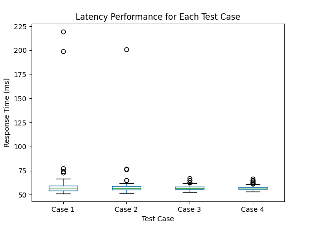

# ECE444-PRA5: Deploying an ML APP to the Cloud

## Latency Results
Here were the averages for each case in ms:
Test Case
Case 1    60.439620
Case 2    58.780115
Case 3    57.438099
Case 4    57.022431

Below is a boxplot visualizing the response times for the 100 requests:




## API Endpoint
- **Deployed URL**: `http://serve-sentiment-env.eba-gt2b3ixf.us-east-2.elasticbeanstalk.com/predict`
- **Method**: POST
- **Input**: A JSON payload with a `text` field containing the news headline.
  
Example:
```json
{
  "text": "Scientists confirm that the Earth is actually flat and not round."
}
